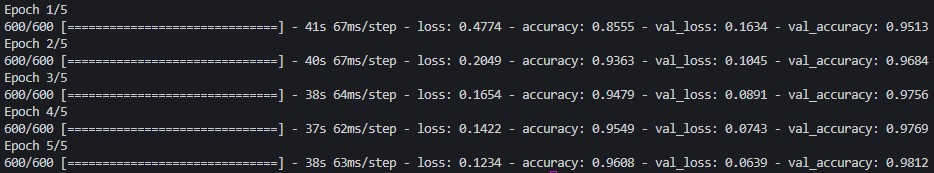
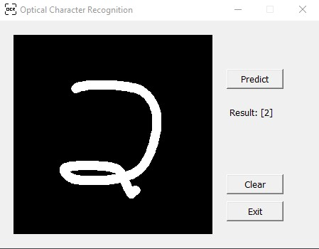
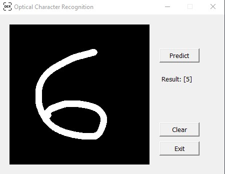

# Optical Character Recognition (OCR) for Handwritten Digits using TensorFlow

This project implements Optical Character Recognition (OCR) using TensorFlow, enabling the extraction of textual information from a handwritten digit on canvas. It can process handwritten or printed text, making it ideal for applications such as document digitization, license plate recognition, and text extraction from scanned images.

## Features
*   Preprocessing Pipeline: Includes grayscale conversion, normalization, and resizing image for optimal recognition.
*   Custom Deep Learning Model: Uses TensorFlow for training a Convolutional Neural Network (CNN) to recognize characters.
*   Interactive Testing: Allows users to test custom images drawn in canvas for digit recognition.
*   Real-time Performance: Efficient prediction for deployment in real-world applications.

## Dataset
MNIST dataset is used in this project which can be loaded through TensorFlow datasets.
Consist of:
*   60000 Training images of Handwritten Digits.
*   10000 Test images for evaluation.

## Model Architecture
* Convolutional Layer with ReLU Activation
* Maxpool Layer with Dropout of 50%
* Linear Layer with ReLU Activation
* Linear Layer
* Softmax

## Results
*   Model achieved ~98% accuracy on training phase on MNIST test set.

*   Model prediction on tkinter canvas:
    *   Correct prediction:
        

    *   Wrong prediction:
        

## How it works
*   Extract image from canvas and are resized to 28 x 28 pixels and normalized before feeding the image to the model.
*   Pre trained model predicts the digit drawn on canvas.

## Future Enhancements
*   Add more dataset.
*   Deploy the app as a web app or mobile app for wider accesability.